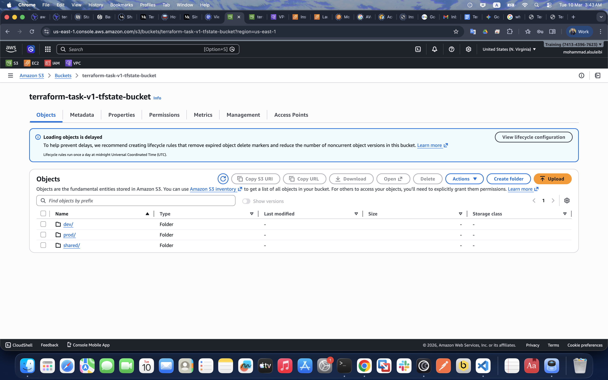
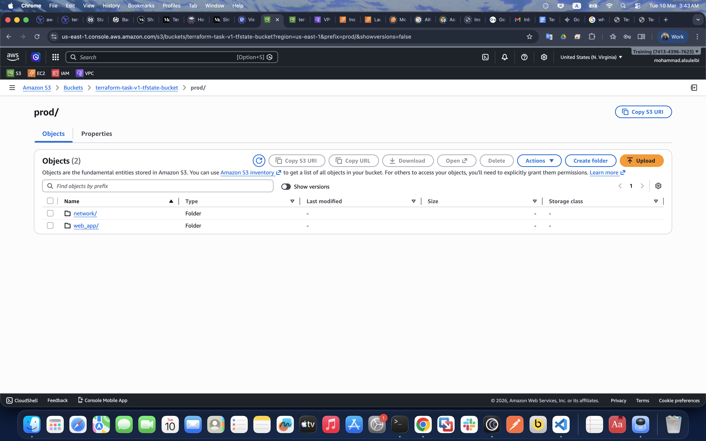
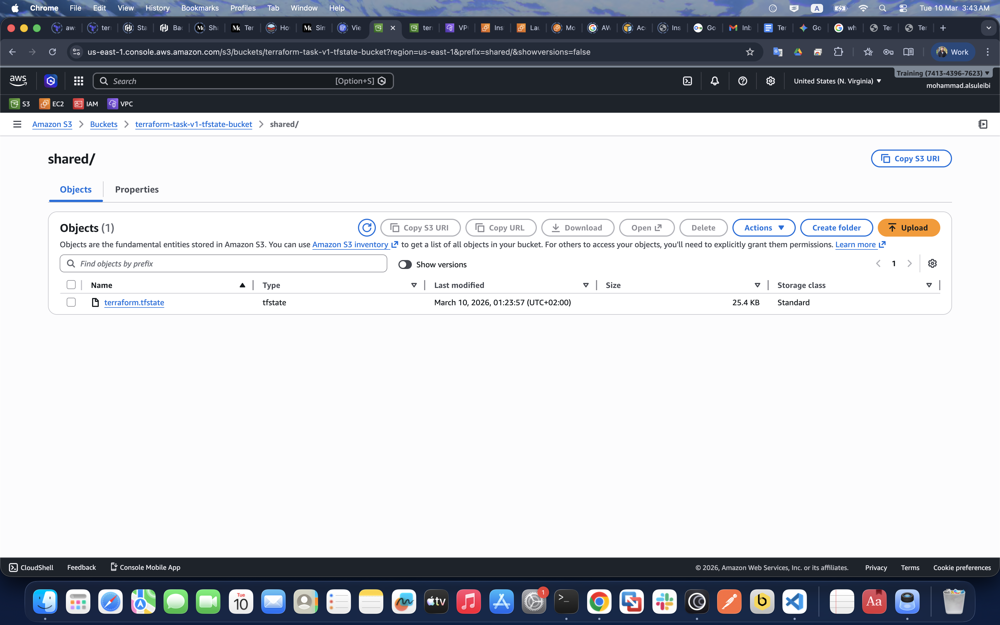
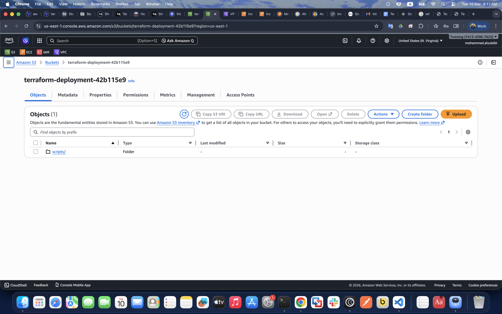
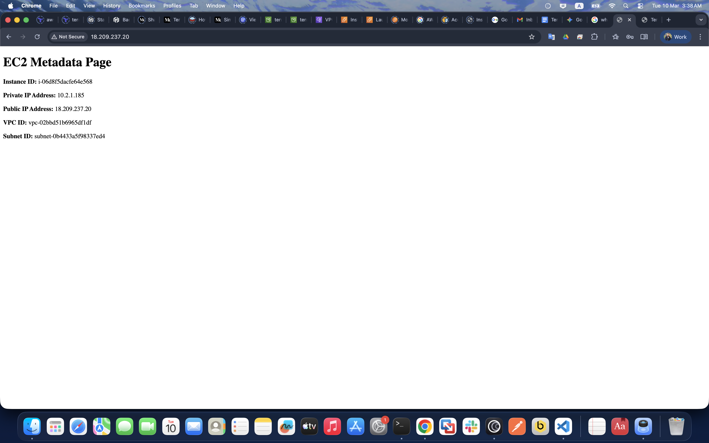
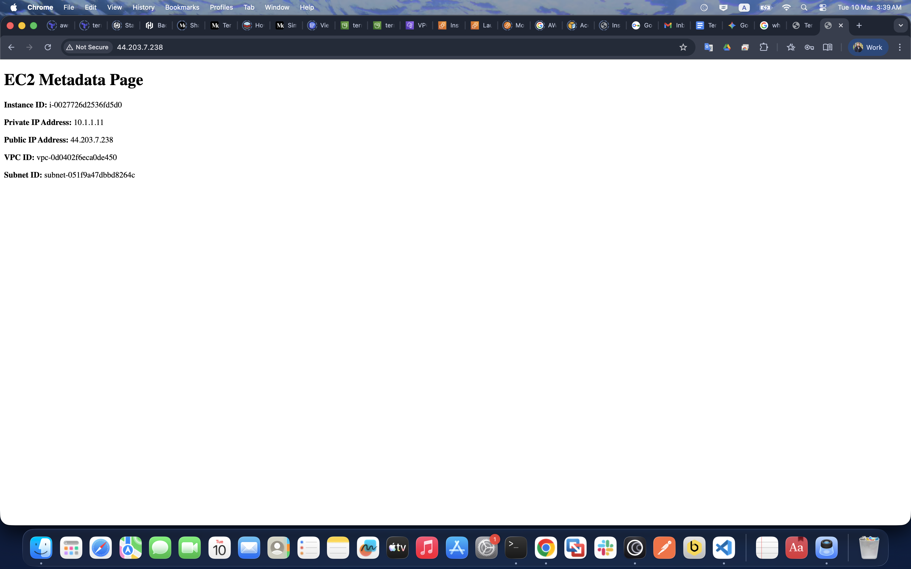
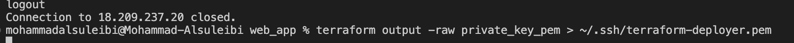
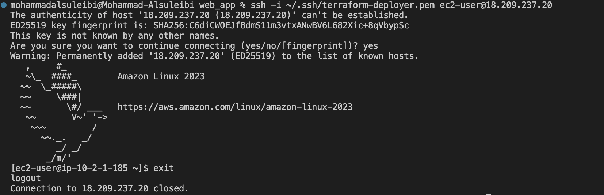
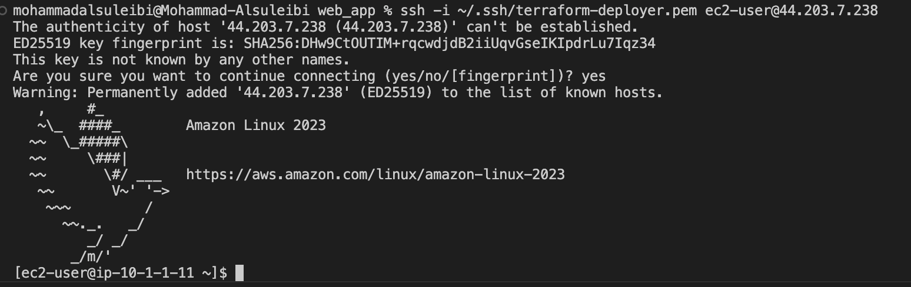
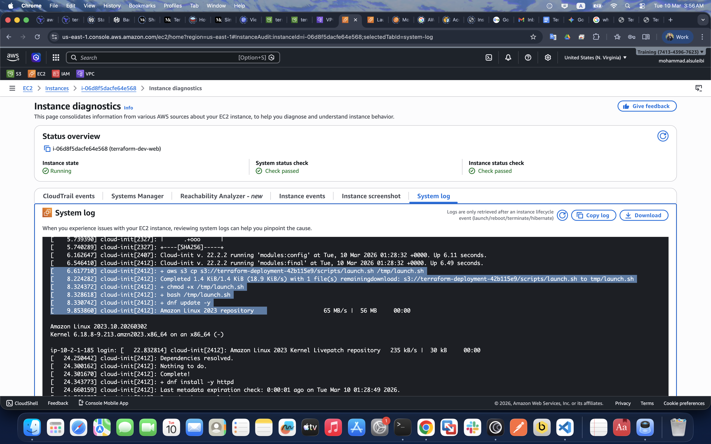

# Terraform Multi-Tier AWS Infrastructure

Decoupled multi-tier AWS infrastructure across Dev and Prod environments using Terraform remote state, a reusable module, and secure EC2 bootstrapping via S3.

## Apply Order

```bash
# 1. Shared layer
cd shared/
terraform init
terraform apply

# Save the generated private key immediately after
terraform output -raw private_key_pem > ~/.ssh/terraform-deployer.pem
chmod 400 ~/.ssh/terraform-deployer.pem

# 2. Networking
cd ../dev/network/
terraform init
terraform apply

cd ../../prod/network/
terraform init
terraform apply

# 3. Web application
cd ../../dev/web_app/
terraform init
terraform apply

cd ../../prod/web_app/
terraform init
terraform apply
```

---

## Deliverables

###  AWS S3 backend bucket showing five distinct .tfstate files.




---
###  Deployment S3 Bucket — launch.sh Uploaded

---
### EC2 Metadata - Dev VPC:


### EC2 Metadata - Prod VPC:

---



### ssh to dev-instance:

### ssh to prod-instance

---
### Verification that the EC2 User Data successfully downloaded the script from S3

